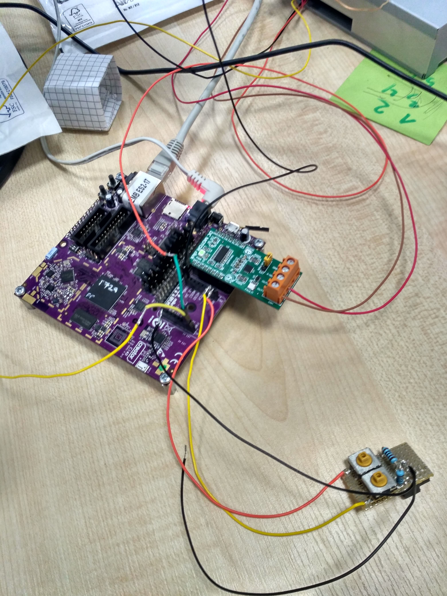

# ci40-sesame-door-simulator

The Ci40-sesame-door-simulator is a lab project to allow a garage door IoT interface to be tested. The Creator Sesame project implements the control needed to bring IoT functionality to an Autoglide MKIII garage door, this sesame door simulator recreates the built-in motor/door functionality of the Autoglide MKIII so that the sesame system can be tested in a desk environment.

[Sesame youtube video](https://www.youtube.com/watch?v=cXrg5ei1hVM)

---

This implementation uses DC Motor Relay Switch. Below info how to wire things and how to set jumpers.

ci40:

* Jumpers JP1 and JP9 in position 2-3. All other jumpers in position 1-2.

DC Motor click:

* Motor PWR Jumper in position INT

DC Motor click put in Mikrobus 1

CD tray wiring:

* Red Wire -> DC Motor Out 2
* Brown Wire -> DS Motor Out 1
* Black Wire -> Mikrobus 2 GND
* Orange Wire -> Mikrobus 2 INT
* Yellow Wire -> Mikrobus 2 PWM

Buttons:

* Mikrobus 2 GND -> Button switch 1 -> Mikrobus 2 AN
* Mikrobus 2 GND -> Button switch 2 -> Mikrobus 2 RST

Attached photo for better understanding:

* Button 1 will switch between slow/fast tray open.
* Button 2 will trigger start/stop movement of tray.

---

## Help

If you have any problems installing or utilising this project, please look into 
our [Creator Forum](https://forum.creatordev.io). 

Otherwise, If you have come across a nasty bug or would like to suggest new 
features to be added then please go ahead and open an issue or a pull request 
against this repo.

## License

Please see the [license](LICENSE) file for a detailed explanation.

## Contributing

Any Bug fixes and/or feature enhancements are welcome. Please see the 
[contributing](CONTRIBUTING.md) file for a detailed explanation.

--- 